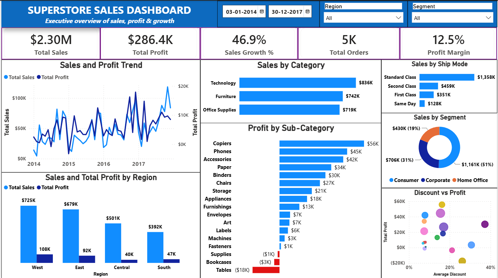
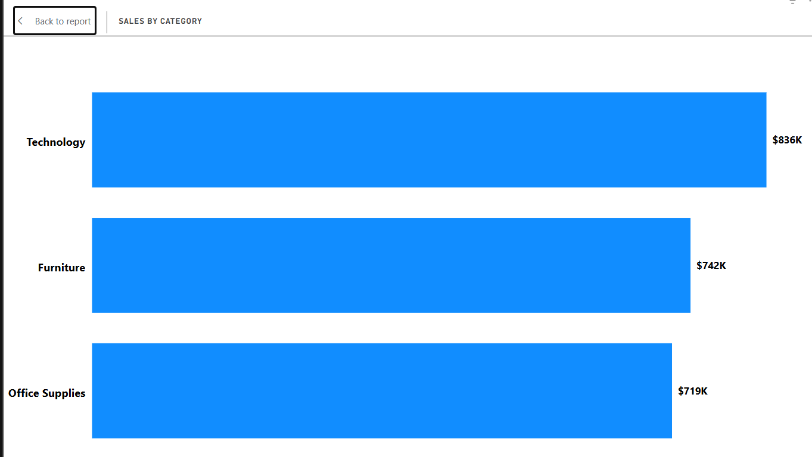
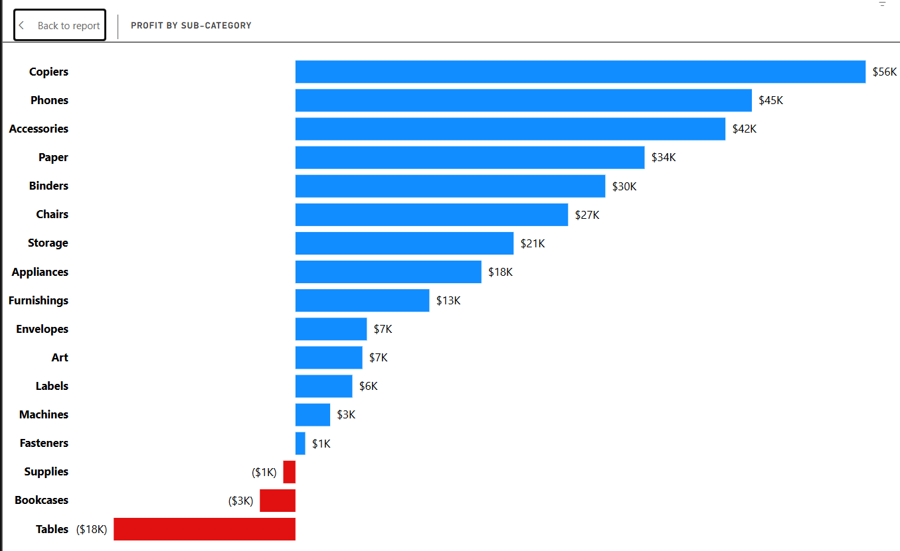
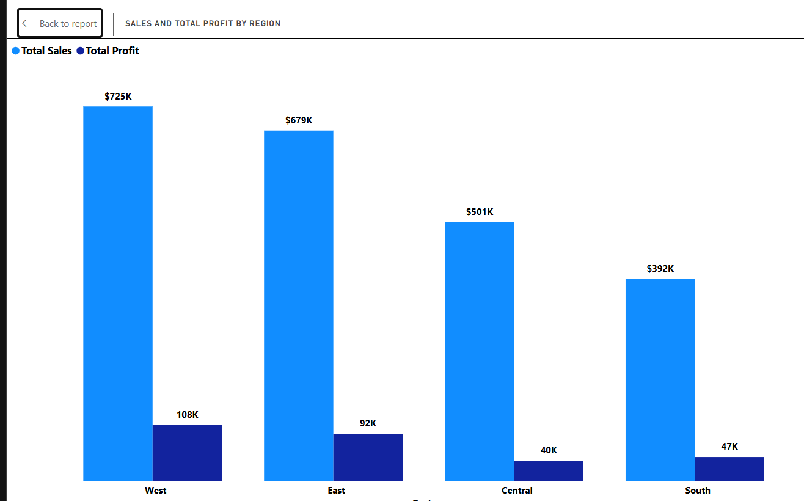
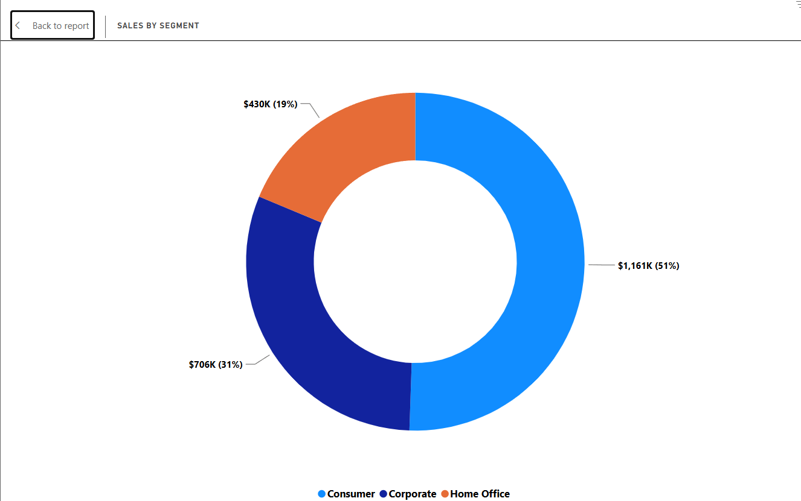
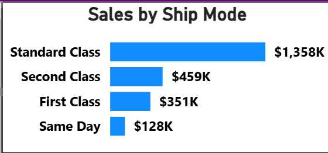
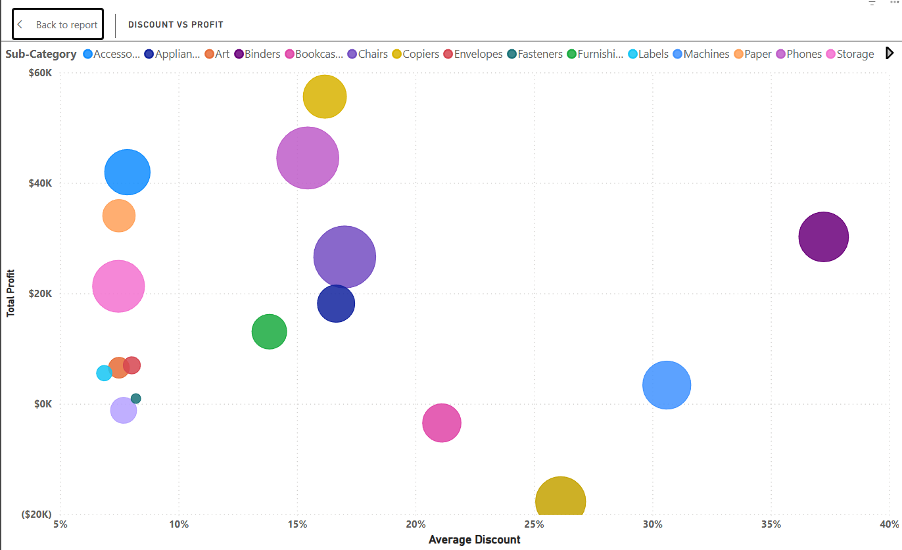

# 📊 Superstore Sales Performance Dashboard

> An interactive Power BI dashboard designed to provide an executive overview of **Sales, Profit, Growth, Orders, regional performance, category performance, and discount impact** using the Superstore dataset.

---

## 🎯 Objective

The goal of this project is to transform raw Superstore sales data into an **interactive business dashboard** that helps stakeholders quickly understand overall performance and identify areas requiring attention.

The dashboard focuses on:

- Tracking key business KPIs
- Monitoring Sales and Profit trends
- Comparing category and regional performance
- Understanding customer segment contribution
- Analyzing shipping modes
- Identifying profitable and loss-making sub-categories
- Exploring the relationship between discounts and profit

---

## 📂 Dataset

The dashboard uses the Superstore dataset containing **9,994 records and 21 columns**.

### Key Fields

`Order Date` · `Ship Date` · `Sales` · `Profit` · `Quantity` · `Discount` · `Category` · `Sub-Category` · `Segment` · `Region` · `Ship Mode`

---

## 🖥️ Dashboard Preview



> An interactive executive dashboard providing a consolidated view of **Sales, Profit, Growth, Orders, Margin, category performance, regional performance, customer segments, shipping modes, and discount impact**.

---

## 📌 Dashboard KPIs

| KPI | Value |
|---|---:|
| **Total Sales** | **$2.30M** |
| **Total Profit** | **$286.4K** |
| **Sales Growth** | **46.9%** |
| **Total Orders** | **5K** |
| **Profit Margin** | **12.5%** |

> KPI values are calculated dynamically and respond to the selected dashboard filters.

---

## 🛠️ Tools Used

- 📊 **Power BI**
- 🧮 **DAX**
- 📁 **CSV**
- 📑 **PowerPoint**

---

## 📈 Key Visuals

### 📅 Sales & Profit Trend


Monthly Sales and Profit are tracked across **2014–2017**, providing a clear view of performance fluctuations and overall trends.

### 🏷️ Sales by Category



Technology leads category-level Sales at approximately **$836K**, followed by Furniture at **$742K** and Office Supplies at **$719K**.

### 📊 Profit by Sub-Category



The visual highlights strong and weak profit contributors. **Copiers, Phones, and Accessories** are among the strongest contributors, while **Tables, Bookcases, and Supplies** generate negative Profit.

### 🌎 Sales & Profit by Region



The **West** leads regional performance with approximately **$725K Sales and $108K Profit**, while Central generates more Sales than South but lower Profit.

### 👥 Sales by Segment



The **Consumer segment** contributes the largest share of Sales at approximately **51%**, followed by Corporate at 31% and Home Office at 19%.

### 🚚 Sales by Ship Mode



**Standard Class** generates the highest Sales at approximately **$1.36M**, followed by Second Class, First Class, and Same Day.

### 💸 Discount vs Profit



The scatter plot compares **Average Discount** with **Total Profit** across sub-categories, helping identify areas where higher discount levels coincide with weaker profitability.

---

## 🎛️ Interactive Features

The dashboard includes interactive filters for:

- 📅 **Order Date**
- 🌎 **Region**
- 👥 **Segment**

Selections dynamically update the dashboard KPIs and visualizations, allowing users to explore performance across different periods, regions, and customer segments.

The Power BI file also preserves the interactive dashboard experience and focused visual analysis.

---

## 💡 Key Business Insights

### 1. Technology leads overall
Technology generates the highest Sales and Profit among the three major categories.

### 2. Furniture has a profitability concern
Furniture generates approximately **$742K in Sales** but only around **$18K in Profit**, indicating significant margin pressure.

### 3. West is the strongest region
The West leads in both Sales and Profit, while Central generates more Sales than South but produces lower Profit.

### 4. Consumer segment dominates Sales
Consumer contributes approximately **51% of total Sales**, making it the largest customer segment.

### 5. Profitability varies by sub-category
Copiers, Phones, and Accessories are strong profit contributors, while **Tables, Bookcases, and Supplies** generate negative Profit.

### 6. Higher Sales do not guarantee higher Profit
The dashboard demonstrates why Sales and Profit should be evaluated together when assessing business performance.

---

## 💡 Strategic Action Plan

### 1. Profit Margin Rehabilitation

Review discount thresholds and product-level costs for loss-making Furniture sub-categories, particularly Tables and Bookcases. Implement bundle pricing strategies to clear slow-moving Furniture inventory without further sacrificing base margins.

**Target:** Reduce the combined **$21.1K loss** from Tables and Bookcases through improved pricing, discount control, and inventory strategies.

### 2. Growth Acceleration

Reallocate promotional focus toward high-profit sub-categories such as **Copiers, Phones, and Accessories**. Prioritize targeted marketing campaigns and growth opportunities in these high-yield areas to improve overall return on investment.

### 3. Implement Discounting Guardrails

Establish category-specific discount guidelines for products with high discount levels and weak profitability. Review high-discount transactions to reduce unnecessary margin erosion while maintaining competitive pricing.

### 4. Ongoing Performance Tracking

Establish a monthly review of **Sales, Profit, and Discount** performance. Track volatile categories and sub-categories regularly to identify emerging margin pressure and enable timely pricing and promotional adjustments.

---

## 📁 Project Structure

```text
superstore_dataset-powerbi-dashboard/
│
├── 📂 Images/
│   ├── Dashboard.png
│   ├── Sales_Profit_Trend.png
│   ├── Sales_Profit_by_Region.png
│   ├── Discount_vs_Profit.png
│   ├── Sales_by_Segment.png
│   ├── Sales_by_Ship_Mode.png
│   ├── Profit_by_Sub_Category.png
│   └── Sales_by_Category.png
│
├── 📂 Dataset/
│   └── Superstore.csv
│
├── 📂 Presentation/
│   └── Superstore_Dashboard_Summary.pptx
│
├── 📂 PowerBI/
│   └── Superstore_Sales_Dashboard.pbix
│
└── README.md
